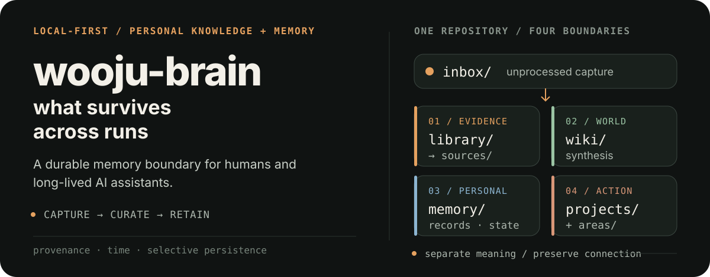
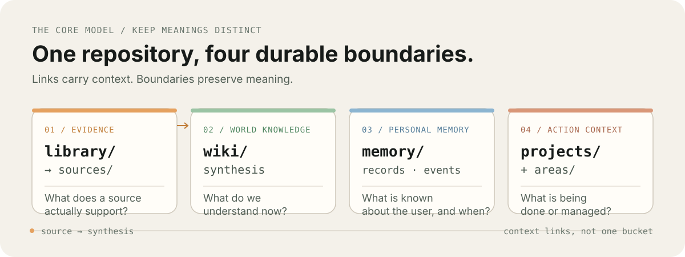
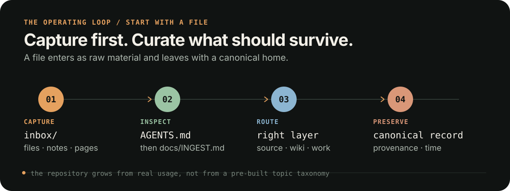

# wooju-brain

<p align="center">
  
</p>

> **Wooju thinks and acts. Wooju Brain remembers.**

`wooju-brain` is a local-first personal knowledge and memory system for people and long-lived AI assistants. It keeps evidence, world knowledge, personal memory, and active work distinct so useful context can accumulate without every note becoming an unqualified fact.

## The system in one glance

<p align="center">
  
</p>

The repository has four canonical layers. Each one answers a different question, and links carry context without collapsing the meanings together.

| Layer | Canonical home | Question it answers |
| --- | --- | --- |
| **Evidence** | `library/` → `sources/` | What does this identifiable source support? |
| **World knowledge** | `wiki/` | What do we currently understand about the world? |
| **Personal memory** | `memory/records/`, `memory/events/`, `memory/state/` | What is known about the user, and when? |
| **Action context** | `projects/`, `areas/` | What is being done or managed? |

One canonical record is better than several near-duplicates. A source note is not automatically general knowledge; personal memory is not a universal fact; project context is not a timeless claim.

## The first useful loop

<p align="center">
  
</p>

Start with the filesystem:

1. Read [`AGENTS.md`](AGENTS.md), the repository constitution.
2. Put files, notes, screenshots, or other unprocessed material in [`inbox/`](inbox/).
3. Ask an agent to process it using [`docs/INGEST.md`](docs/INGEST.md).
4. Keep only the durable context that will improve future work, in its canonical layer.

> **Humans capture to `inbox/`. Agents curate the brain.**

The structure is intentionally conservative. It should grow from real usage, not from a pre-built topic taxonomy.

## Synthesis without epistemic leakage

Wooju Brain supports two related operations:

- **Synthesis** reorganizes, compares, or integrates existing knowledge without materially adding a claim.
- **Insight** derives a new relationship or abstraction that no single supporting source explicitly states.

Derived insights remain in the existing semantic locations—`wiki/`, `projects/`, or `areas/`—rather than a new insight store. A durable insight records `origin: synthesis`, one of five small insight kinds (`pattern`, `connection`, `tension`, `implication`, or `hypothesis`), a lifecycle `status`, and `derived_from` links. Those links show where the idea came from; they do not prove the derived relationship.

The lifecycle is deliberately lightweight:

```text
knowledge → candidate → challenge → provisional → support/testing → established
                              ↘ rejected       ↘ superseded (when replaced)
```

Local synthesis is a focused part of normal ingest and does not force an insight from every source. Deep synthesis runs only after an explicit user request. Candidate and provisional ideas remain visibly derived and uncertain; reusable world insights and project-specific implications are routed to different canonical homes. See [`docs/SYNTHESIS.md`](docs/SYNTHESIS.md) for the page shape, challenge checklist, rigorous-mode integration, and examples.

## Boundaries that keep memory trustworthy

- **Provenance:** `sources/` records what evidence says; `wiki/` records reusable understanding about the world.
- **Time:** mutable personal facts carry temporal context. `memory/events/` preserves history; `memory/state/` provides the latest projection.
- **Inference:** explicit user information outranks model inference. Inference must not be silently promoted into an explicit personal fact.
- **Work:** use `projects/` for finite goals and `areas/` for responsibilities that continue indefinitely. Both link to canonical knowledge and memory instead of duplicating them.
- **Privacy:** credentials, private keys, recovery codes, financial account numbers, and similarly sensitive secrets do not belong in the knowledge graph.

### Verification depth

The default quality mode is [`standard`](wooju-brain.yaml): low friction with provenance, source boundaries, uncertainty, and conflict preservation. [`rigorous`](docs/EPISTEMICS.md) adds material-claim checks, contradiction search, epistemic status, and risk-based human review when stronger verification is warranted.

Both modes use the same canonical structure. Rigorous verification strengthens the knowledge; it does not create a separate trusted copy.

## Working with AI agents

`AGENTS.md` is the always-loaded contract for agents working here. Detailed procedures keep the invariants small and make specialized work reviewable.

| Task | Read before work |
| --- | --- |
| Add or synthesize knowledge | [`docs/KNOWLEDGE.md`](docs/KNOWLEDGE.md) |
| Derive or review an insight | [`docs/SYNTHESIS.md`](docs/SYNTHESIS.md) |
| Verify claims rigorously | [`docs/EPISTEMICS.md`](docs/EPISTEMICS.md) |
| Create or update personal memory | [`docs/MEMORY.md`](docs/MEMORY.md) |
| Work on a project or area | [`docs/WORK.md`](docs/WORK.md) |
| Capture or ingest new material | [`docs/INGEST.md`](docs/INGEST.md) |
| Search or answer from the knowledge base | [`docs/RETRIEVAL.md`](docs/RETRIEVAL.md) |
| Change repository mechanics | [`docs/OPERATIONS.md`](docs/OPERATIONS.md) |

The intended hierarchy is:

```text
AGENTS.md          always-loaded invariants
    ↓
docs/*.md          task-specific procedures
    ↓
repository data    retrieved only when relevant
```

## What belongs here

Keep material a future reader or assistant is likely to need again:

- durable concepts, explanations, and mental models;
- source-backed research notes and retained source artifacts;
- reusable procedures, preferences, goals, constraints, and decisions;
- current-state summaries and meaningful historical events;
- active project and life-area context.

Do not turn the repository into a transcript archive. Greetings, filler, temporary chatter, raw chain-of-thought, duplicate explanations, and one-off details do not belong in the durable knowledge graph.

<details>
<summary>Repository map</summary>

```text
wooju-brain/
├── README.md                 # human-facing introduction
├── AGENTS.md                 # repository constitution for AI agents
├── CLAUDE.md -> AGENTS.md    # same rules for Claude Code
├── wooju-brain.yaml          # repository-level behavior settings
│
├── docs/                     # task-specific operating manuals
│   ├── KNOWLEDGE.md          # sources, wiki, synthesis, evidence quality
│   ├── SYNTHESIS.md          # derived insight lifecycle and challenge rules
│   ├── EPISTEMICS.md         # rigorous claim verification and human review
│   ├── MEMORY.md             # personal-memory admission and lifecycle rules
│   ├── WORK.md               # projects and ongoing areas
│   ├── INGEST.md             # capture, classify, promote
│   ├── RETRIEVAL.md          # search order, freshness, conflicts
│   └── OPERATIONS.md         # naming, links, validation, logs, indexes
│
├── inbox/                    # unprocessed capture
├── library/                  # retained original source artifacts/references
├── sources/                  # notes grounded in identifiable sources
├── wiki/                     # durable knowledge about the world
├── memory/                   # durable knowledge about the user
│   ├── records/              # facts, preferences, goals, constraints, decisions
│   ├── events/               # append-oriented personal history
│   └── state/                # current-state projections
├── projects/                 # finite goal-oriented work
├── areas/                    # ongoing responsibilities and life/work domains
├── logs/                     # meaningful repository change history
├── scripts/                  # deterministic maintenance and validation tools
├── index.md                  # root navigation / generated summary
├── indexes/                 # generated secondary indexes
└── archive/                  # retired but historically useful material
```

</details>

## Design principles

- **Local-first.** Plain files stay readable without a specific application or model.
- **Provenance-aware.** Durable claims preserve where they came from.
- **Temporal.** Mutable personal facts do not silently become timeless truths.
- **Connected.** Useful knowledge accumulates into synthesis rather than isolated notes.
- **Challenged.** Derived insight is challenged before it is promoted.
- **Selective.** Future usefulness matters more than maximum capture.
- **Agent-neutral.** The system should work with different AI assistants.
- **Evolutionary.** Add indexing, automation, and runtime components only when real usage requires them.

## Relationship to Wooju

Wooju Brain is intended to become a durable knowledge and memory foundation for the [Wooju](https://github.com/seulchan/wooju) agent runtime while remaining useful on its own.

- **Wooju** is the cognitive runtime: it decides what matters now, what to focus on, and what action to take.
- **Wooju Brain** preserves what should survive across runs: world knowledge, personal memory, project context, and history.

The projects should remain architecturally independent. Retrieval should come before automatic persistence, and future durable writes should continue to respect provenance, privacy, temporal, and memory-admission rules.

> **Memory is what survives. Context is what matters now.**

## Status

Early architecture. The immediate goal is to validate the boundaries and workflows with real usage before adding heavier retrieval infrastructure or runtime integration.

## License

Wooju Brain is licensed under the PolyForm Noncommercial License 1.0.0.

Noncommercial use is permitted. Commercial use requires separate permission.

See [`LICENSE`](LICENSE) for details.
